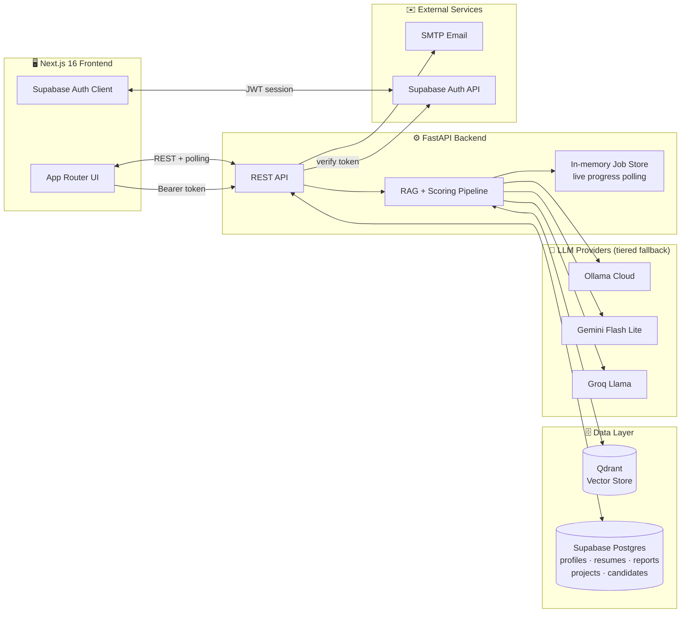
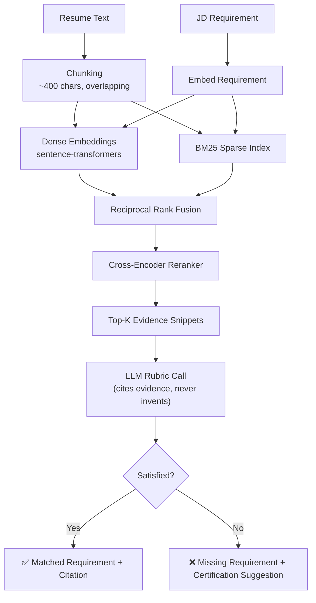
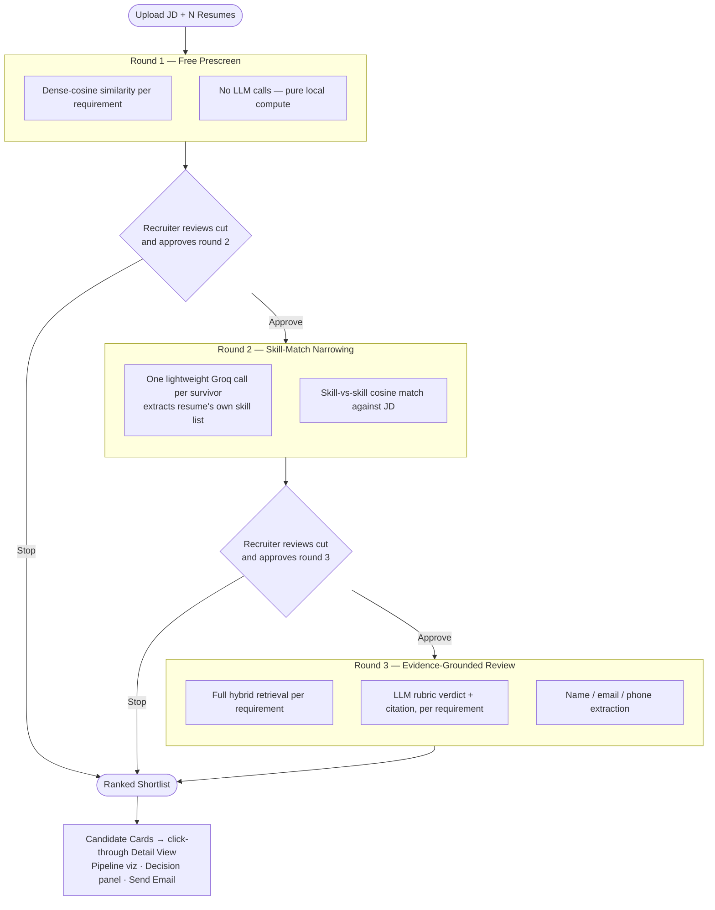
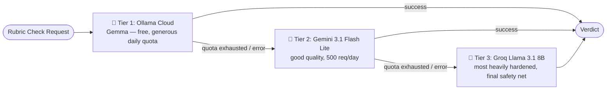
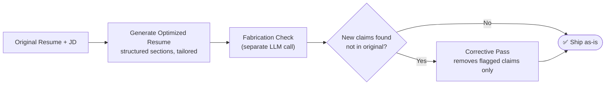
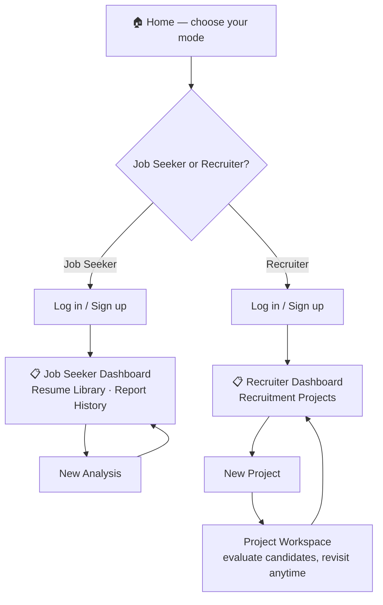
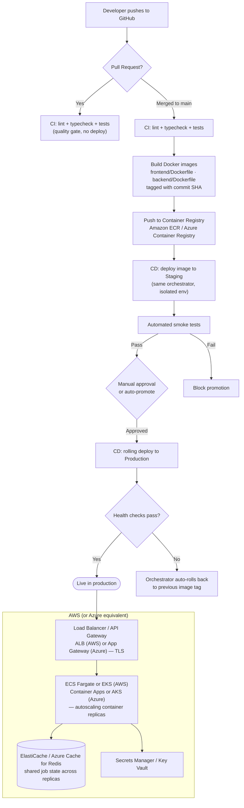

# 🚀 AI Resume & Job Matcher


A full-stack, dual-mode recruitment platform that goes far beyond keyword matching. It uses a hybrid RAG (retrieval-augmented generation) pipeline to **ground every AI verdict in cited evidence**, a three-round funnel to keep LLM cost proportional to how far a candidate has progressed, and persistent, authenticated dashboards for both **Job Seekers** and **Recruiters**.

This isn't a single Streamlit script — it's a real client/server application: a **Next.js 16** frontend, a **FastAPI** backend, **Supabase** for auth and relational persistence, and **Qdrant** for vector search, with a resilient multi-provider LLM fallback chain so it keeps working even when a free-tier quota runs out mid-session.

---

## 📹 Demo

> 🎥 **Job Seeker mode walkthrough** — _video coming soon_
>
> 🎥 **Recruiter mode walkthrough** — _video coming soon_

<!--
  Drop your recorded demos in here, e.g.:
  <video src="https://github.com/user-attachments/assets/<id>" controls style="max-width: 100%;"></video>
-->

---

## Table of Contents

- [Why this project is interesting](#-why-this-project-is-interesting)
- [System architecture](#-system-architecture)
- [How the RAG evidence pipeline works](#-how-the-rag-evidence-pipeline-works)
- [The recruiter's three-round funnel](#-the-recruiters-three-round-funnel)
- [The tiered LLM fallback chain](#-the-tiered-llm-fallback-chain)
- [Job Seeker mode](#-job-seeker-mode)
- [Recruiter mode](#-recruiter-mode)
- [Authentication & dashboards](#-authentication--dashboards)
- [Tech stack](#-tech-stack)
- [Project structure](#-project-structure)
- [Getting started](#-getting-started)
- [Environment variables](#-environment-variables)
- [Design decisions & trade-offs](#-design-decisions--trade-offs)
- [Path to production & monetization](#-path-to-production--monetization)
- [Roadmap](#-roadmap)

---

## 💡 Why this project is interesting

Most "AI resume matcher" projects are a single LLM call wrapped in a chat prompt. This one is built the way a production recruiting tool would actually need to work:

- **Every AI verdict cites its evidence.** A requirement is never marked "satisfied" without a specific resume snippet backing it up — retrieved via hybrid BM25 + dense-vector search, reranked with a cross-encoder, and verified by an LLM whose prompt forces it to quote, not guess.
- **LLM cost scales with how much scrutiny a candidate has earned.** A recruiter uploading 50 resumes doesn't get 50 expensive, evidence-grounded reviews — a cheap local prescreen narrows the field first (see [the three-round funnel](#-the-recruiters-three-round-funnel)).
- **It survives free-tier rate limits.** A three-tier LLM fallback chain (Ollama Cloud → Gemini → Groq) means a single provider's quota exhaustion doesn't take the whole app down mid-session.
- **The AI Resume Optimizer has a fabrication guardrail.** Rewriting a resume to sound stronger is easy; making sure it never invents a skill, number, or credential the candidate never claimed is the actual hard problem — solved with a dedicated verification pass, not just a "please don't lie" prompt.
- **It's a real multi-user product**, not a local script: Supabase-backed auth, role-based dashboards, and persistent, reopenable Recruitment Projects that recruiters can revisit and keep adding candidates to over time.

---

## 🏗️ System Architecture



**Why an in-memory job store *and* Postgres?** Live progress (which candidate is being scored right now, streaming activity text) is ephemeral and polled every 2 seconds — persisting that to a database would be pure overhead. Once a batch finishes, its final results are written to Postgres so the recruiter can close the tab and reopen the project days later. The two layers serve genuinely different lifetimes.

---

## 🔍 How the RAG Evidence Pipeline Works

This is the core piece that makes every score explainable instead of a black-box number.



1. **Chunking** splits the resume into overlapping windows small enough for precise retrieval, large enough to preserve context.
2. **Hybrid retrieval** fuses dense (semantic) and BM25 (lexical/keyword) search via Reciprocal Rank Fusion — dense search alone misses exact tool-name matches; BM25 alone misses paraphrased skills.
3. **Cross-encoder reranking** re-scores the fused candidates with a model that actually reads the query and passage together, far more precise than either retrieval signal alone.
4. **The LLM only ever sees the retrieved evidence for one requirement at a time** — it's explicitly told a snippet from one requirement's evidence block can never be cited for a different requirement, which prevents cross-attribution hallucinations under batching.

---

## 🎯 The Recruiter's Three-Round Funnel

Screening every resume with a full evidence-grounded LLM review would be accurate but far too slow and expensive for a batch of 50+ candidates. Instead, scrutiny escalates only for candidates who survive the round before:



**Nothing runs unattended between rounds** — the recruiter explicitly approves each cut before the next (more expensive) round starts, and can stop at any point with whatever's been computed so far finalized cleanly.

**Ranking across rounds is tiered, not blended.** A round-1-only candidate's dense-cosine score and a round-3 candidate's LLM-verified rubric score are fundamentally different methodologies on different scales — they're never compared directly. Candidates are ranked first by *how far they got through the funnel*, then by that round's own native score within the tier.

---

## 🔗 The Tiered LLM Fallback Chain

Free-tier LLM quotas are small. Rather than let one exhausted quota break the whole rubric-scoring pipeline, each check runs through three tiers, falling through only on failure:



A tier marked exhausted today is automatically retried once the day rolls over (daily quotas reset at midnight), instead of being permanently skipped.

---

## 🧑‍💻 Job Seeker Mode

| Feature | What it does |
|---|---|
| **Eligibility Check** | Flags hard blockers (degree, minimum experience) before spending any LLM budget. |
| **Requirement Breakdown** | Every JD requirement, matched or missing, with the exact evidence snippet and confidence behind the verdict. |
| **Tailored Cover Letter** | Generated from the resume + JD, highlighting genuinely relevant experience. |
| **AI Resume Optimizer** | Rewrites the resume section-by-section for ATS-friendliness and JD relevance — see below. |
| **Downloadable PDF** | The optimized resume renders to a clean, ATS-friendly PDF, one click away. |
| **Resume Library & Report History** | Every analysis is saved — reopen a past report or resume without re-uploading anything. |

### The Resume Optimizer's fabrication guardrail



The rewrite and the fact-check are **deliberately two separate LLM calls** — asking one model to both improve wording *and* self-police for honesty in the same pass is asking it to grade its own homework. A dedicated verification step compares the rewritten text against the original and flags anything (a skill, a number, a certification) that wasn't genuinely there before a single word ships to the user.

---

## 🕵️ Recruiter Mode

| Feature | What it does |
|---|---|
| **Recruitment Projects** | Each hiring campaign (e.g. "AI Engineer") is a persistent, reopenable workspace — its JD is set once, and candidates accumulate across multiple upload batches over time. |
| **Card-Based Shortlist** | Name, experience, Overall Fit %, and Skill Fit % per candidate, click through to a full detail view. |
| **Pipeline Visualization** | See exactly which round a candidate reached and their score at each stage. |
| **Decision Panel** | A plain-language recommendation (Strong Hire / Hire / Consider / Weak Match) with the top reasons for and against — synthesized from the same rubric verdicts, not a separate LLM call. |
| **Individual Email Sending** | Contact info (name/email/phone) is LLM-extracted from the resume; send an Interview Invitation, Rejection, or other templated email straight from a candidate's detail page. |
| **Not-Advancing Transparency** | Candidates cut at round 1 or 2 aren't hidden — you can see exactly which round they reached and why they didn't proceed. |

---

## 🔐 Authentication & Dashboards



- **Supabase Auth** handles email/password signup and session management; the chosen role (Job Seeker / Recruiter) is stored on the account.
- **One account, one mode** — a Job Seeker account can't wander into the Recruiter workspace and vice versa; each account is locked to the role it registered with.
- The FastAPI backend verifies every authenticated request's Supabase JWT directly against Supabase's own Auth API, so the backend never has to manage signing keys or rotate secrets itself.

---

## 🛠️ Tech Stack

**Frontend**
- Next.js 16 (App Router, Proxy/Middleware) · React 19 · TypeScript
- Tailwind CSS v4 · shadcn/ui (`@base-ui/react` primitives)
- Framer Motion (`motion`) for stagger reveals, blur-fade transitions, hover-lift
- Supabase (`@supabase/ssr`, `@supabase/supabase-js`) for auth

**Backend**
- FastAPI · Python 3.10+
- **Retrieval**: `sentence-transformers` (dense embeddings), `rank_bm25` (sparse), a cross-encoder reranker, Qdrant (vector store)
- **LLMs**: Groq, Google Gemini (`google-genai`), Ollama Cloud — tiered fallback chain
- **Persistence**: Supabase Postgres via SQLAlchemy
- **Documents**: PyMuPDF, `python-docx` (reading), `fpdf2` (PDF generation)
- **Email**: `smtplib` (SMTP)

---

## 📁 Project Structure

```
Job_Resume_Matcher/
├── backend/
│   ├── app/
│   │   ├── api/routes/        # job_seeker.py, recruiter.py — FastAPI routers
│   │   ├── core/               # llm.py, auth.py, embeddings.py, reranker.py, vector_store.py
│   │   ├── db/                 # SQLAlchemy models, session, CRUD (Supabase Postgres)
│   │   ├── models/             # Pydantic schemas (shared request/response shapes)
│   │   └── services/           # rag_matching, recruiter_service, job_seeker_service,
│   │                           #   resume_optimizer, resume_pdf, email_service, job_store...
│   └── requirements.txt
│
├── frontend/
│   └── src/
│       ├── app/                # job-seeker/, recruiter/, login/, signup/ (App Router pages)
│       ├── components/         # app/ (feature components), ui/ (shadcn primitives), motion/
│       ├── lib/                # api.ts, types.ts, supabase/, category-theme.ts
│       └── proxy.ts            # auth-aware route protection (Next.js 16's renamed Middleware)
│
└── test/                       # sample resumes + JD for manual/e2e testing
```

---

## 🚀 Getting Started

### Prerequisites
- Python 3.10+
- Node.js 20+
- A [Supabase](https://supabase.com) project (Auth + Postgres)
- A [Qdrant](https://qdrant.tech) instance (cloud or self-hosted)
- API keys: [Groq](https://console.groq.com), [Google AI Studio](https://aistudio.google.com) (Gemini), optionally [Ollama Cloud](https://ollama.com)

### 1. Clone & configure environment

```bash
git clone https://github.com/Soban-2004/Job_Resume_Matcher.git
cd Job_Resume_Matcher
```

Create a `.env` in the project root (see [Environment Variables](#-environment-variables) below).

### 2. Backend

```bash
cd backend
pip install -r requirements.txt
uvicorn app.main:app --reload
```

The API serves on `http://localhost:8000`. Tables are created automatically on startup if they don't already exist.

### 3. Frontend

```bash
cd frontend
npm install
```

Create `frontend/.env.local`:

```bash
NEXT_PUBLIC_API_BASE_URL=http://localhost:8000
NEXT_PUBLIC_SUPABASE_URL=<your-supabase-project-url>
NEXT_PUBLIC_SUPABASE_ANON_KEY=<your-supabase-anon-key>
```

```bash
npm run dev
```

Visit `http://localhost:3000` — you'll land on the mode picker, then be prompted to sign up/log in for whichever mode you choose.

---

## 🔑 Environment Variables

**Root `.env`** (backend):

| Variable | Purpose |
|---|---|
| `GROQ_API_KEY` | Groq LLM inference (fallback tier 3 + several lighter calls) |
| `GEMINI_API_KEY` | Gemini Flash Lite (fallback tier 2) |
| `QDRANT_URL` / `QDRANT_API_KEY` | Vector store for resume chunk embeddings |
| `SUPABASE_URL` / `SUPABASE_ANON_KEY` / `SUPABASE_SERVICE_ROLE_KEY` | Auth verification |
| `DATABASE_URL` | Supabase Postgres connection string (SQLAlchemy) |
| `SMTP_HOST` / `SMTP_PORT` / `SMTP_USERNAME` / `SMTP_PASSWORD` / `SMTP_FROM_EMAIL` / `SMTP_FROM_NAME` / `SMTP_USE_TLS` | Recruiter → candidate email sending |

**`frontend/.env.local`**:

| Variable | Purpose |
|---|---|
| `NEXT_PUBLIC_API_BASE_URL` | Backend URL |
| `NEXT_PUBLIC_SUPABASE_URL` / `NEXT_PUBLIC_SUPABASE_ANON_KEY` | Client-side Supabase Auth |

> ⚠️ Never commit `.env` or `.env.local` — both are already gitignored. The service role key in particular grants full backend-level database access.

---

## 🧠 Design Decisions & Trade-offs

A few choices worth calling out explicitly, since they're not obvious from the code alone:

- **Evidence-grounding over raw LLM trust.** Every "satisfied" verdict must cite a real resume snippet; an unsatisfied requirement's evidence field is force-cleared even if the model tries to populate it, closing a self-contradictory failure mode some smaller models fall into.
- **Tiered ranking, never blended scores.** Round 1's cosine score and round 3's rubric score are apples and oranges — candidates are ranked by funnel depth first, native score second, never averaged together.
- **In-memory job state is a deliberate trade-off, not an oversight.** Live per-candidate progress genuinely doesn't need to survive a server restart; only final results are persisted. (This did bite us once mid-development — a backend restart mid-approval lost an in-flight batch — which is exactly the trade-off being made explicit here.)
- **A stateless PDF-render endpoint.** Resume PDF generation takes the full resume JSON as input and returns bytes — no job ID, no server-side state — so it isn't coupled to any job's lifetime.
- **Ownership checks in application code, not Postgres RLS.** The backend connects directly to Supabase's Postgres rather than through PostgREST, so Row-Level Security wouldn't receive per-request JWT claims automatically. Ownership is enforced explicitly in every query instead — the well-understood, predictable pattern until RLS is deliberately layered on as defense-in-depth.

---

## 🌐 Path to Production & Monetization

This section sketches how this project would evolve from a portfolio piece into a hosted, paid product — none of it is built yet, but the architecture was chosen with this path in mind.

### How a real deployment of this would work: Docker + CI/CD + cloud container orchestration

A PaaS like Vercel/Render is the fast path for a demo, but a real production deployment — the way companies actually ship containerized apps — looks like this instead: every push builds and tests the code, packages it as a versioned container image, and a pipeline promotes that exact image through environments, with the cloud provider's orchestrator handling scaling, health checks, and rollbacks.



**Why containers + an orchestrator instead of a PaaS:**
- **Docker gives you an identical artifact everywhere** — the exact image tested in CI is the exact image running in production, not "code that happened to build again on someone else's server."
- **The orchestrator (ECS/EKS on AWS, Container Apps/AKS on Azure) handles what a PaaS hides from you**: autoscaling replicas under load, restarting unhealthy containers via liveness probes, rolling deploys with zero downtime, and instant rollback to the last known-good image tag if health checks fail post-deploy.
- **This is also exactly where the `job_store`-is-in-memory constraint stops being optional.** A PaaS's single instance can get away with in-memory state; a real orchestrator's whole point is running multiple replicas behind a load balancer, and a user's poll request landing on a different replica than the one running their job would just 404. Moving job state into Redis (ElastiCache / Azure Cache for Redis) is the prerequisite for this architecture actually working, not a nice-to-have.
- **Infrastructure as Code** (Terraform, or AWS CDK / Azure Bicep) would provision all of this reproducibly — the load balancer, the orchestrator service, the Redis cluster, the secrets store — instead of being clicked together once in a console and never documented.

Secrets move from a plaintext `.env` into Secrets Manager / Key Vault, injected into containers at runtime; `CORS` gets locked to the real frontend domain; and the container registry's image tags (not `latest`) are what every environment actually deploys, so "what's running in production" is always an exact, auditable commit.

### What "productionizing" requires beyond hosting

The gap between "works for me locally" and "safe to charge strangers for" is mostly about **cost control and durability**, not new features:

| Need | Why |
|---|---|
| **Usage metering** | No paid tier is possible without knowing how many LLM calls/analyses each account has used. |
| **Rate limiting / abuse prevention** | Every batch and analysis costs real tokens — one abusive account can burn the whole LLM budget without per-user throttling. |
| **A real job queue** (Celery/RQ + Redis, or leaning harder on Postgres) | `BackgroundTasks` + in-memory state is fine for a demo; losing a paying customer's in-flight project to a backend restart (which happened to *us* mid-session) isn't acceptable at scale. |
| **Billing integration** (Stripe) | Subscriptions plus usage-based line items — e.g. "50 evaluations included, then $X per 10 more." |
| **Observability** (Sentry, structured logs) | Can't just tail a local log file to debug a paying customer's issue. |
| **Compliance** | Real PII (resumes, emails, phone numbers) flowing through the system means a privacy policy, data-retention rules, and GDPR/CCPA awareness stop being optional. |

### Paid-tier structure

The natural axis to charge on is **LLM-heavy operations**, since that's the real marginal cost per user:

**Job Seeker side**
- *Free*: a handful of analyses/month, a capped resume library.
- *Paid*: unlimited analyses, unlimited optimizer downloads + PDF export, priority processing, full report history.

**Recruiter side** — the stronger monetization case, since recruiters have hiring budget and job seekers mostly don't:
- *Free*: 1 active Recruitment Project, small candidate batches (e.g. 10).
- *Paid*: unlimited projects, larger batches, multi-recruiter collaboration on one project, bulk email sending, exports/analytics.
- *Enterprise*: SSO, custom-branded candidate emails, API access, dedicated rate limits, SLA.

**The subtlety that actually drives pricing**: this app currently runs entirely on Groq/Gemini/Ollama's *free* tiers. Paying customers mean either budgeting for paid LLM API tiers and pricing around that real per-user cost, or keeping free-tier accounts strictly capped against the free quotas and reserving paid-API-tier model access for paying customers only. The per-user cost of a recruiter's round-3 review — not a guess — is what should set the price.

---

## 🗺️ Roadmap

Ideas explicitly scoped for later, not yet built:

- [ ] Automated eval harness (golden resume/JD set, hallucination-rate & grounding-accuracy metrics)
- [ ] Test suite + CI pipeline
- [ ] Alembic migrations (currently `create_all`-based schema)
- [ ] Candidate comparison view (side-by-side)
- [ ] Interview-question generation from skill gaps
- [ ] Recruiter notes & interview-stage tracking per candidate
- [ ] Bulk actions (multi-select → send email / move stage)
- [ ] Google OAuth sign-in (currently email/password only)
- [ ] Deployed live demo (Docker Compose: frontend + backend + Qdrant)
- [ ] Full CI/CD + containerized cloud deployment (see [Path to Production](#-path-to-production--monetization))

---

<p align="center">Built as a demonstration of production-shaped RAG architecture — not just an LLM wrapper.</p>
